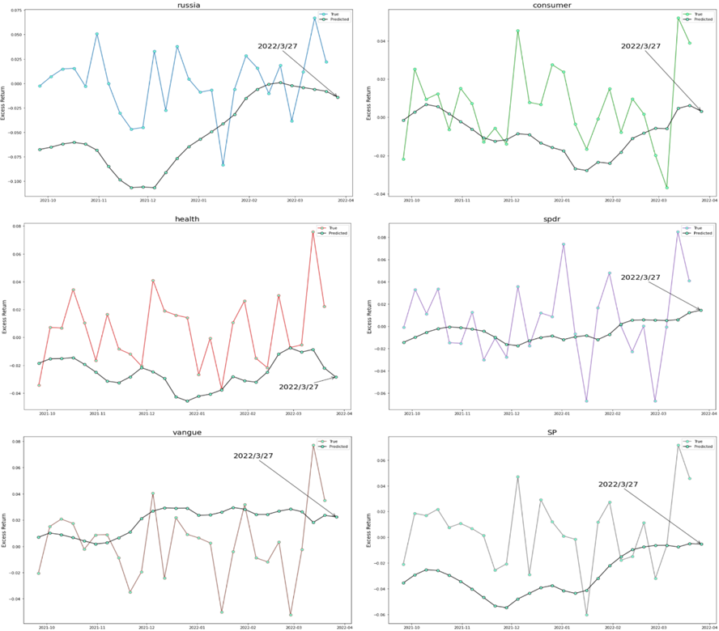

# Optimizing Investment Portfolios using LSTM combined with the Black-Litterman Model

## Introduction

This README presents the implementation of LSTM combined with the Black-Litterman Model for optimizing investment portfolios. The project originated from a group report in the Financial Technology course at National Chengchi University, based on Davide Vena's paper "Active Index Allocation with the Black-Litterman Model" published in 2018.

## Research Summary

In this report, we explore the application of the Black-Litterman Model in asset management, particularly in the context of ETFs. Utilizing supervised learning, we converge the investment scope and incorporate various assets to form an investment portfolio. To construct vectors reflecting the perspectives of investors using the Black-Litterman approach, we employ machine learning techniques, such as Long Short-Term Memory (LSTM) in Recurrent Neural Networks (RNN).

Finally, we evaluate the performance of the optimized asset allocation portfolio and compare it with other relevant indicator combinations.

## Research Methodology

* Compute Hidden Equilibrium Returns
* Calculate Hidden Equilibrium Returns
* Predict Next Period's Returns - Set Viewpoint Q
* Combine Viewpoints - Calculate Posterior Expected Returns
* Compute Posterior Variance - Obtain New Variance Matrix
* Utilize Mean-Variance Optimization - Calculate Optimal Weights

## Results

### LSTM Output:

Visualizations depict the LSTM model's predictions for the returns of seven distinct assets over time. These graphs provide insights into the model's performance in capturing market trends.

### Mean-Variance Optimization:

Graphical representation of the efficient frontier curve illustrates the Mean-Variance Optimization process. Each color on the curve corresponds to a different Sharpe Ratio. 

