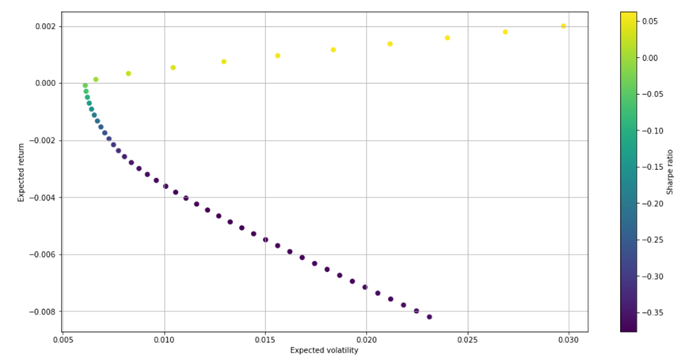

# Optimizing Investment Portfolios using LSTM combined with the Black-Litterman Model

## Introduction

This README presents the implementation of LSTM combined with the Black-Litterman Model for optimizing investment portfolios. The project originated from a group report in the Financial Technology course at National Chengchi University, based on Davide Vena's paper "Active Index Allocation with the Black-Litterman Model" published in 2018.

## Research Methodology

* Compute Hidden Equilibrium Returns
* Calculate Hidden Equilibrium Returns
* Predict Next Period's Returns - Set Viewpoint Q
* Combine Viewpoints - Calculate Posterior Expected Returns
* Compute Posterior Variance - Obtain New Variance Matrix
* Utilize Mean-Variance Optimization - Calculate Optimal Weights

## Results

### LSTM Output:

Visualizations depict the LSTM model's predictions for the returns of seven distinct assets over time. These graphs provide insights into the model's performance in capturing market trends.

### Mean-Variance Optimization:

Graphical representation of the efficient frontier curve illustrates the Mean-Variance Optimization process. Each color on the curve corresponds to a different Sharpe Ratio. 

